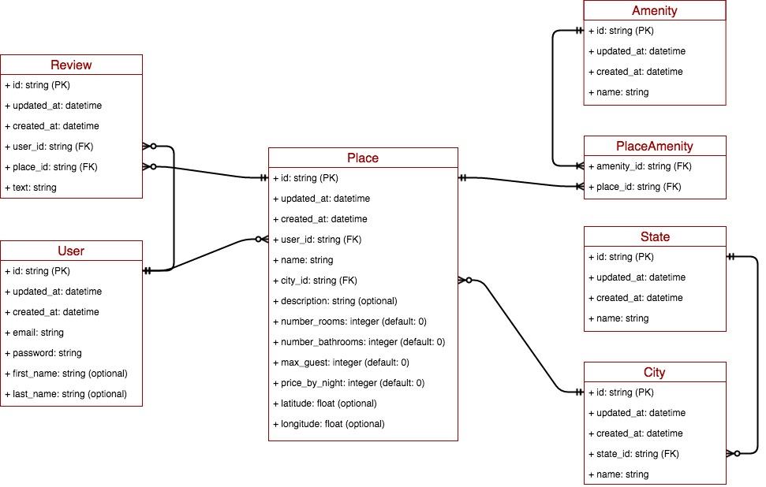

# AirBnB_clone
AirBnB clone built using the Python language and Flask framework as part of the ALX projects

## Project design stages
1. The console project (active-7 days sprint)
2. 

### 1. The Console Project
Deals with serialization/deserialization of Python Object to JSON. The requirements of this module are:
- Data model
- CRUD operation
- Persist to JSON file

#### Data model

The figure shows the different models needed for the project which are:
- User: the logged-in user of the application
- Review: User's review of the place
- Place: Location to be leased
- City: City where the Place is located
- State: State where the Place is located
- PlaceAmenity: junction or intermediary table to resolve many2many relationships between Place and Amenity
- Amenity: Amenity of a Place (there are many amenities in a place and one amenity to several places)

#### Design Architecture
Uses an OOP class with a class attribute for a couple of reasons:
- easy class identification
- provision of default values
- same behaviour for file storage and database storage

## File structure
- `models` - holds all data models
- `models/engine` - holds all storage classes using the same prototype
- `console.py` - entry file for the console project
- `models/base_model.py` - base model class for all data models
- `tests` - holds all test cases
